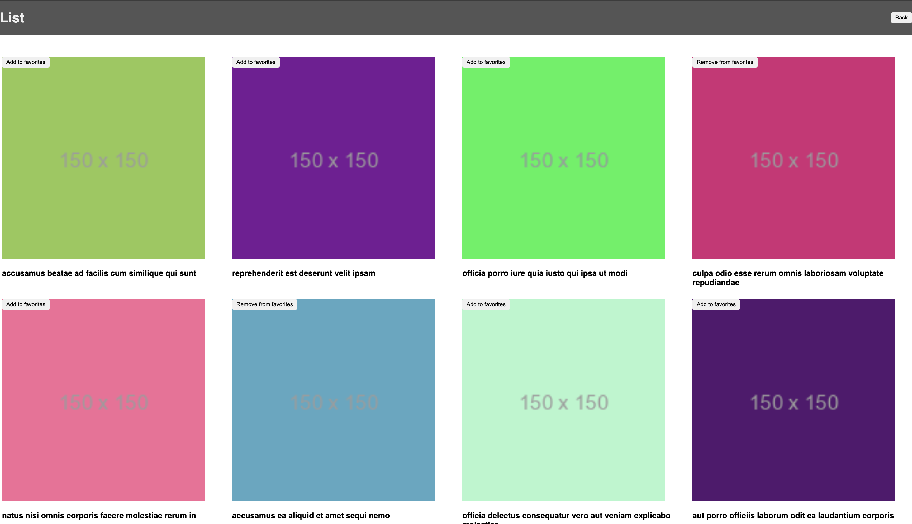
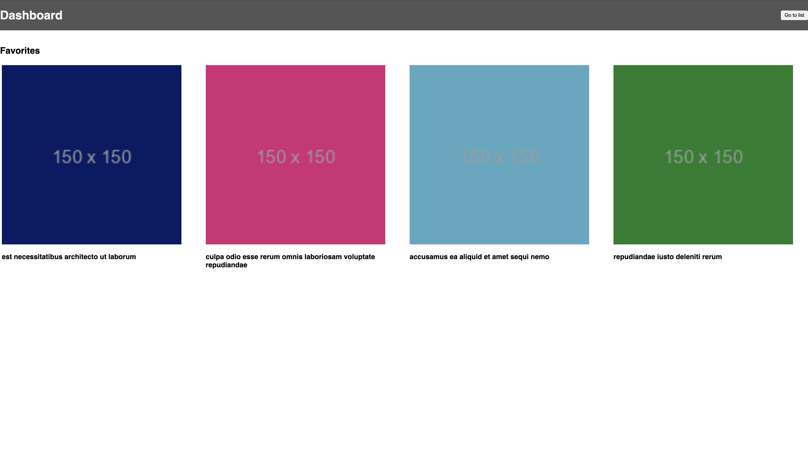

# Album

Album is an app that helps you to add/remove to/from favorites from list page where user can scroll infinitely with lazy loading of content and you can come back to same location after being at dashboard page.




## Libraries Used

[](https://skills.thijs.gg)

## Installation

```bash
npm install
```

## Start

```bash
npm start
```

## Test

```bash
npm run test
```

## Features

- Entry via Dashboard page
  - link to List Page
  - Favorites section
- List page (Lazy load of contents)
  - Back button(dashboard page)
  - Infinite scroll of content

